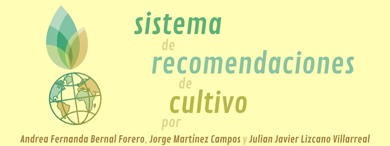

# Sistema-recomendaciones-cultivo

Autores: 
- Andrea Fernanda Bernal Forero
- Jorge Martínez Campos
- Julian Javier Lizcano Villarreal

Objetivo: Predecir el país más adecuado para un cultivo específico, basándose en sus variables de rendimiento y condiciones agroclimáticas.

Dataset:
- Obtenido en FAO Crop Data – Producción de hortalizas: [https://www.fao.org/faostat/en/#data/QCL]

- Alojado en: [https://github.com/jjlizcano/Sistema-recomendaciones-cultivo.git/data/FAOSTAT_data_en_9-1-2025.csv]

Modelos:
- Decision Tree Classifier (DecisionTreeClassifier) from scikit-learn.
- Random Forest Classifier (RandomForestClassifier) from scikit-learn.
- Support Vector Classifier (SVC) from scikit-learn.
- Deep Neural Network (DNN) built with TensorFlow/Keras, consisting of multiple Dense layers.

Enlaces:
  - Código: [https://colab.research.google.com/github/jjlizcano/Sistema-recomendaciones-cultivo/blob/main/notebooks/Primera_entrega_proyecto_IA.ipynb]
  - Video: [https://youtu.be/myJZP7sfxAw]
  - Repositorio: [https://github.com/jjlizcano/Sistema-recomendaciones-cultivo]
